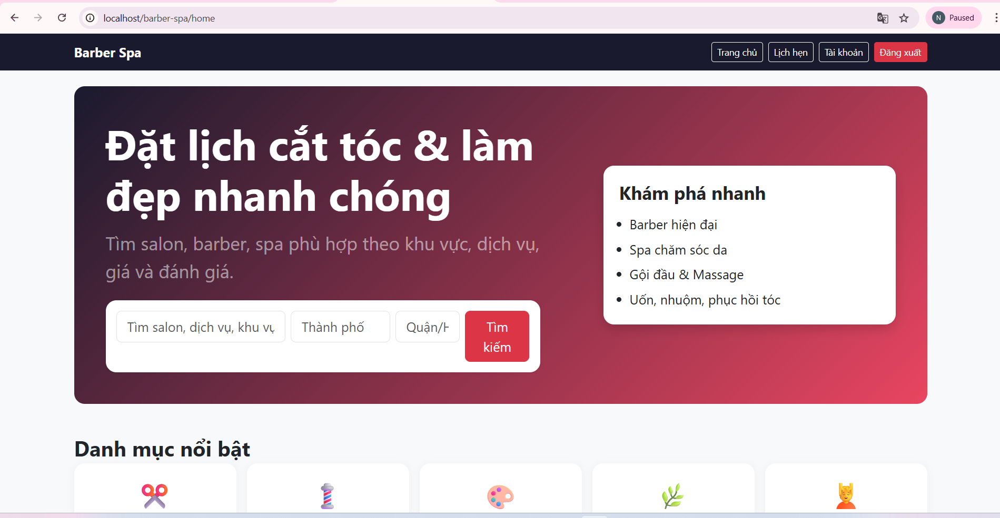
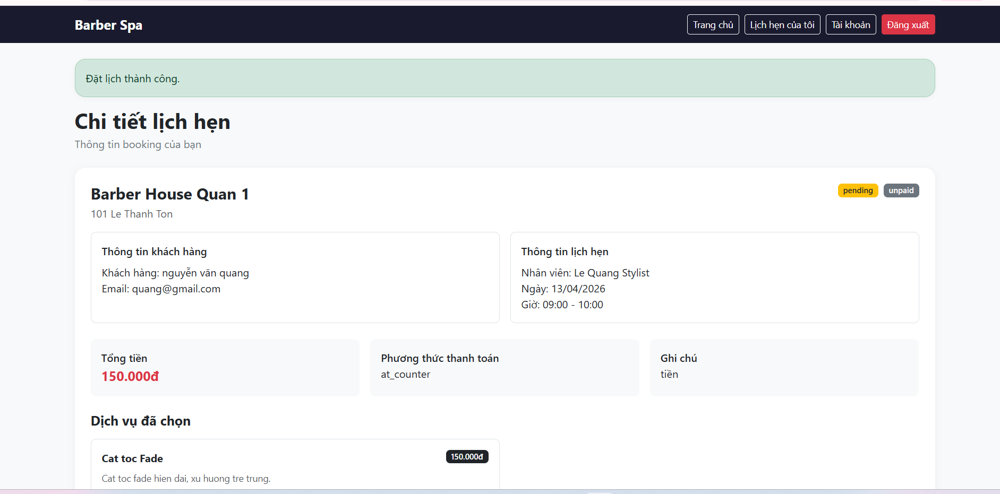
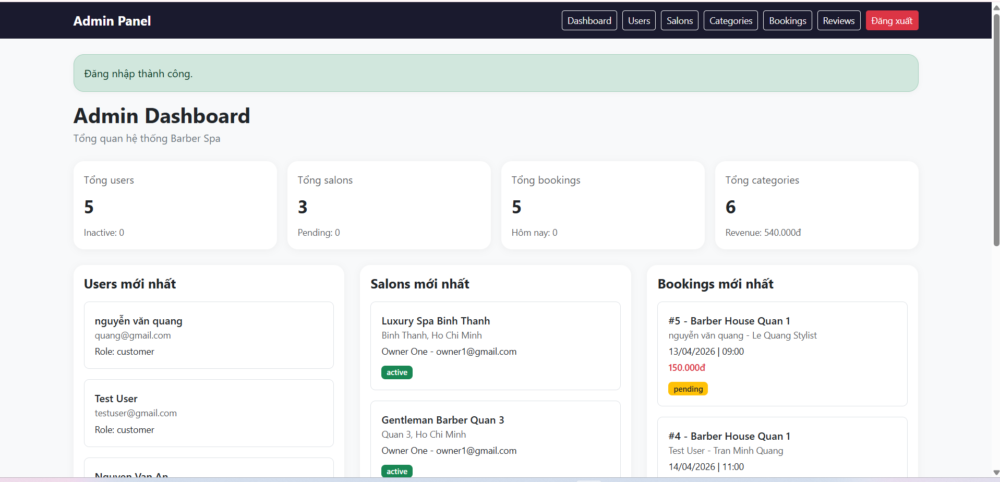

# 💈 Barber Spa - Website Đặt Lịch Cắt Tóc & Làm Đẹp

> **Đồ án / bài tập lớn Lập trình Web nâng cao**  
> Xây dựng hệ thống website cho phép khách hàng tìm kiếm salon/barber, đặt lịch hẹn, thanh toán và quản lý lịch làm đẹp trực tuyến.

---

## 👥 Thành viên nhóm

| STT | Họ và tên        | MSSV        | Vai trò     |
| --- | ---------------- | ----------- | ----------- |
| 1   | Nguyễn Công Sơn  | 23810310102 | Nhóm trưởng |
| 2   | Nguyễn Văn Quang | 23810310108 | Thành viên  |
| 3   | Nguyễn Văn Danh  | 23810310136 | Thành viên  |

---

Hệ thống hỗ trợ 3 vai trò chính:

- **Khách hàng (User/Customer):** tìm kiếm salon, xem dịch vụ, đặt lịch, thanh toán, theo dõi lịch hẹn
- **Chủ salon (Owner):** quản lý salon, dịch vụ, nhân viên, lịch làm việc, booking, doanh thu
- **Quản trị viên (Admin):** quản lý users, salons, categories, bookings, reviews và giám sát toàn hệ thống

---

## 🚀 Công nghệ sử dụng

| Thành phần | Công nghệ                                                |
| ---------- | -------------------------------------------------------- |
| Frontend   | HTML, CSS, JavaScript, Bootstrap 5                       |
| Backend    | PHP 8 thuần theo mô hình MVC                             |
| Database   | MySQL / MariaDB                                          |
| Web server | Apache (XAMPP)                                           |
| Thanh toán | Payment giả lập local, có cấu trúc để mở rộng VNPay/Momo |

---

## 📋 Tài liệu Đặc tả Yêu cầu Phần mềm (SRS)

Các tài liệu SRS được lưu trong thư mục [`/docs/srs/`](./docs/srs/)

| Mã        | Chức năng                 | Tài liệu                                                      | Trạng thái |
| --------- | ------------------------- | ------------------------------------------------------------- | ---------- |
| AUTH-01   | Xác thực người dùng       | [SRS_AUTH.md](./docs/srs/SRS_AUTH.md)                         | ✅         |
| SEARCH-01 | Tìm kiếm & khám phá salon | [SRS_SEARCH.md](./docs/srs/SRS_SEARCH.md)                     | ✅         |
| BOOK-01   | Đặt lịch hẹn              | [SRS_BOOKING.md](./docs/srs/SRS_BOOKING.md)                   | ✅         |
| PAY-01    | Thanh toán                | [SRS_PAYMENT.md](./docs/srs/SRS_PAYMENT.md)                   | ✅         |
| SALON-01  | Quản lý salon             | [SRS_SALON_MANAGEMENT.md](./docs/srs/SRS_SALON_MANAGEMENT.md) | ✅         |
| REVIEW-01 | Đánh giá & review         | [SRS_REVIEW.md](./docs/srs/SRS_REVIEW.md)                     | ✅         |
| ADMIN-01  | Quản trị hệ thống         | [SRS_ADMIN.md](./docs/srs/SRS_ADMIN.md)                       | ✅         |

---

## 🗂️ Cấu trúc thư mục dự án

```text
barber-spa/
├── api/
│   ├── autocomplete.php
│   ├── get-slots.php
│   ├── hold-slot.php
│   └── payment/
│       ├── momo-config.php
│       ├── momo-redirect.php
│       ├── momo-return.php
│       ├── vnpay-config.php
│       ├── vnpay-redirect.php
│       └── vnpay-return.php
├── config/
│   └── db.php
├── controllers/
│   ├── AuthController.php
│   ├── BookingController.php
│   ├── PaymentController.php
│   ├── ReviewController.php
│   ├── SearchController.php
│   ├── UserController.php
│   ├── admin/
│   │   ├── BookingController.php
│   │   ├── CategoryController.php
│   │   ├── DashboardController.php
│   │   ├── ReviewController.php
│   │   ├── SalonController.php
│   │   └── UserController.php
│   └── owner/
│       ├── BookingController.php
│       ├── DashboardController.php
│       ├── RevenueController.php
│       ├── ReviewController.php
│       ├── SalonController.php
│       ├── ServiceController.php
│       └── StaffController.php
├── core/
│   ├── Auth.php
│   ├── Database.php
│   └── helpers.php
├── database/
│   └── schema.sql
├── docs/
│   └── srs/
│       ├── SRS_ADMIN.md
│       ├── SRS_AUTH.md
│       ├── SRS_BOOKING.md
│       ├── SRS_PAYMENT.md
│       ├── SRS_REVIEW.md
│       ├── SRS_SALON_MANAGEMENT.md
│       └── SRS_SEARCH.md
├── models/
│   ├── Booking.php
│   ├── Category.php
│   ├── Payment.php
│   ├── Refund.php
│   ├── Review.php
│   ├── Salon.php
│   ├── Service.php
│   ├── Staff.php
│   └── User.php
├── public/
│   ├── css/
│   │   └── style.css
│   ├── images/
│   ├── js/
│   └── uploads/
│       ├── avatars/
│       ├── reviews/
│       ├── salons/
│       └── services/
├── views/
│   ├── admin/
│   ├── auth/
│   ├── booking/
│   ├── errors/
│   ├── layouts/
│   ├── owner/
│   ├── payment/
│   ├── review/
│   ├── search/
│   └── user/
├── .htaccess
├── index.php
└── README.md
```

✨ Chức năng chính của hệ thống

1. Khách hàng (User / Customer)
   Đăng ký, đăng nhập, đăng xuất
   Quên mật khẩu / đặt lại mật khẩu
   Tìm kiếm salon theo từ khóa, khu vực, danh mục
   Xem chi tiết salon
   Xem danh sách dịch vụ và nhân viên
   Đặt lịch hẹn theo quy trình nhiều bước
   Xem danh sách lịch hẹn của tôi
   Xem chi tiết booking
   Hủy lịch hẹn khi còn hiệu lực
   Thanh toán local giả lập cho booking online
2. Chủ salon (Owner)
   Xem dashboard thống kê salon
   Quản lý booking của salon
   Xem doanh thu
   Quản lý dịch vụ
   Quản lý nhân viên
   Quản lý lịch làm việc theo tuần
   Quản lý ngày nghỉ riêng của nhân viên
3. Quản trị viên (Admin)
   Dashboard tổng quan hệ thống
   Quản lý users
   Quản lý salons
   Quản lý categories
   Quản lý bookings
   Quản lý

---

⚙️ Hướng dẫn cài đặt và chạy dự án

1. Yêu cầu môi trường
   XAMPP
   PHP 8.x
   MySQL / MariaDB
   Trình duyệt web
   phpMyAdmin
2. Đưa project vào thư mục htdocs

Ví dụ:

C:\aiu\htdocs\barber-spa

3.  Khởi động Apache và MySQL trong XAMPP

Mở XAMPP Control Panel rồi start:

Apache
MySQL

4. Tạo database

Vào phpMyAdmin và tạo database mới:

barber_spa

Khuyến nghị collation:

utf8mb4_unicode_ci

5. Import database

Mở phpMyAdmin:

Chọn database barber_spa
Chọn tab Import
Chọn file:
database/schema.sql
Bấm Import

6. Cấu hình kết nối database

Mở file:

config/db.php

cập nhật đúng thông tin máy bạn, ví dụ:

define('DB_HOST', '127.0.0.1');
define('DB_NAME', 'barber_spa');
define('DB_USER', 'root');
define('DB_PASS', '');

7. Truy cập dự án

Mở trình duyệt:

http://localhost/barber-spa
🔐 Tài khoản test

Có thể thay đổi tùy theo dữ liệu seed hiện tại trong database/schema.sql

Admin
Email: admin@barberspa.vn
Password: Admin@123
Owner
Email: owner1@gmail.com
Password: Owner@123
Customer
Email: quang@gmail.com
Password: Customer@123

## Nếu mật khẩu không đúng do đã thay đổi trong quá trình test, có thể reset lại bằng script tạm ở local rồi xóa script ngay sau khi dùng.

---

📸 Ảnh chụp màn hình đề xuất khi nộp/demo
User


Admin


---

🧪 Gợi ý kiểm thử nhanh
User flow
Đăng ký tài khoản mới
Đăng nhập
Tìm kiếm salon
Đặt lịch
Xem booking
Thanh toán giả lập
Hủy lịch nếu cần
Owner flow
Đăng nhập owner
Xem dashboard
Quản lý service
Quản lý staff
Cập nhật lịch làm việc
Xem booking và revenue
Admin flow
Đăng nhập admin
Xem dashboard
Khóa / mở khóa user
Ẩn / mở salon
Thêm / sửa / xóa category
Quản lý booking
Kiểm duyệt review

_Hà Nội, tháng 04 năm 2026_
