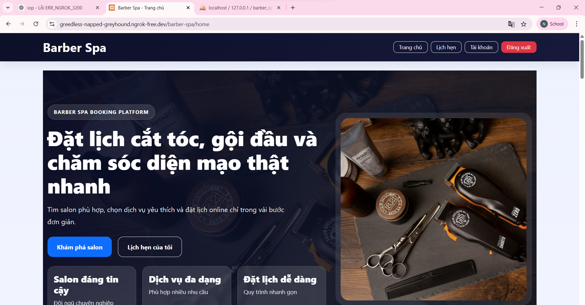
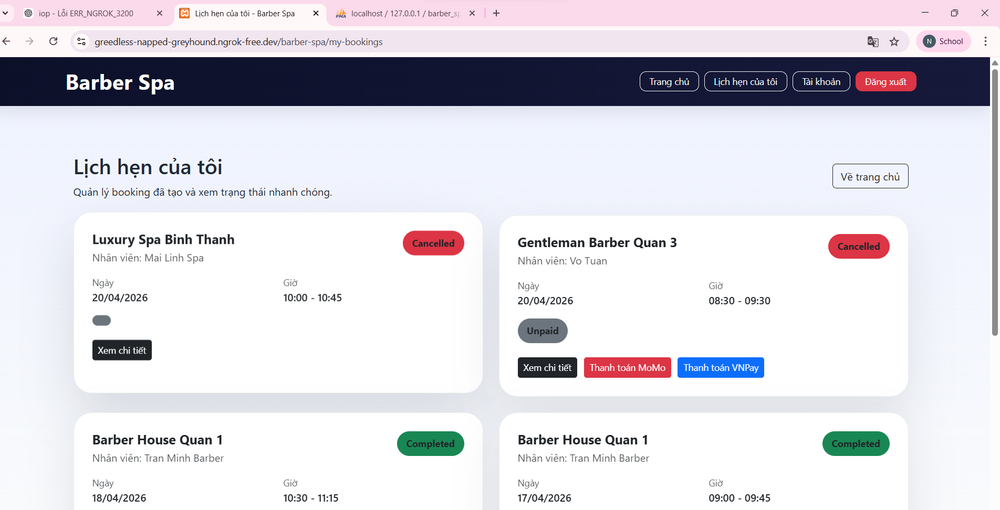
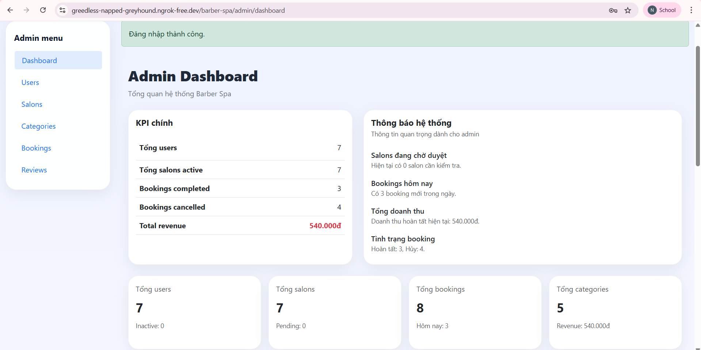

SỬ DỤNG CÁC FILE CODE TÍCH HỢP SANG PHẦN CHÍNH - MAIN.
# 💈 Barber Spa - Website Đặt Lịch Cắt Tóc & Làm Đẹp.
> **Đồ án / bài tập lớn Lập trình Web nâng cao**  
> Xây dựng hệ thống website cho phép khách hàng tìm kiếm salon/barber, đặt lịch hẹn, thanh toán và quản lý lịch làm đẹp trực tuyến.

---

## 👥 Thành viên nhóm

| STT | Họ và tên        | MSSV        | Vai trò     |
| --- | ---------------- | ----------- | ----------- |
| 1   | Nguyễn Công Sơn  | 23810310102 | Nhóm trưởng |
| 2   | Nguyễn Văn Quang | 23810310108 | Thành viên  |
| 3   | Nguyễn Văn Danh  | 23810310136 | Thành viên  |

---

Hệ thống hỗ trợ 3 vai trò chính:

- **Khách hàng (User/Customer):** tìm kiếm salon, xem dịch vụ, đặt lịch, thanh toán, theo dõi lịch hẹn
- **Chủ salon (Owner):** quản lý salon, dịch vụ, nhân viên, lịch làm việc, booking, doanh thu
- **Quản trị viên (Admin):** quản lý users, salons, categories, bookings, reviews và giám sát toàn hệ thống

---

## 🚀 Công nghệ sử dụng

| Thành phần | Công nghệ                                                |
| ---------- | -------------------------------------------------------- |
| Frontend   | HTML, CSS, JavaScript, Bootstrap 5                       |
| Backend    | PHP 8 thuần theo mô hình MVC                             |
| Database   | MySQL / MariaDB                                          |
| Web server | Apache (XAMPP)                                           |
| Thanh toán | Payment giả lập local, có cấu trúc để mở rộng VNPay |

---

## 📋 Tài liệu Đặc tả Yêu cầu Phần mềm (SRS)

Các tài liệu SRS được lưu trong thư mục [`/docs/srs/`](./docs/srs/)

| Mã        | Chức năng                 | Tài liệu                                                      | Trạng thái |
| --------- | ------------------------- | ------------------------------------------------------------- | ---------- |
| AUTH-01   | Xác thực người dùng       | [SRS_AUTH.md](./docs/srs/SRS_AUTH.md)                         | ✅         |
| SEARCH-01 | Tìm kiếm & khám phá salon | [SRS_SEARCH.md](./docs/srs/SRS_SEARCH.md)                     | ✅         |
| BOOK-01   | Đặt lịch hẹn              | [SRS_BOOKING.md](./docs/srs/SRS_BOOKING.md)                   | ✅         |
| PAY-01    | Thanh toán                | [SRS_PAYMENT.md](./docs/srs/SRS_PAYMENT.md)                   | ✅         |
| SALON-01  | Quản lý salon             | [SRS_SALON_MANAGEMENT.md](./docs/srs/SRS_SALON_MANAGEMENT.md) | ✅         |
| REVIEW-01 | Đánh giá & review         | [SRS_REVIEW.md](./docs/srs/SRS_REVIEW.md)                     | ✅         |
| ADMIN-01  | Quản trị hệ thống         | [SRS_ADMIN.md](./docs/srs/SRS_ADMIN.md)                       | ✅         |

---

## 🗂️ Cấu trúc thư mục dự án

```text
barber-spa/
├── api/
│   ├── autocomplete.php
│   ├── get-slots.php
│   ├── hold-slot.php
│   └── payment/
│       ├── vnpay-config.php
│       ├── vnpay-redirect.php
│       └── vnpay-return.php
├── config/
│   ├── db.php
│   ├── mail.php
│   ├── vnpay.php         [NEW] Cấu hình VNPay payment
├── controllers/
│   ├── AuthController.php
│   ├── BookingController.php
│   ├── PaymentController.php
│   ├── ReviewController.php
│   ├── SearchController.php
│   ├── UserController.php
│   ├── admin/
│   │   ├── BookingController.php
│   │   ├── CategoryController.php
│   │   ├── DashboardController.php
│   │   ├── ReviewController.php
│   │   ├── SalonController.php
│   │   └── UserController.php
│   └── owner/
│       ├── BookingController.php
│       ├── DashboardController.php
│       ├── RevenueController.php
│       ├── ReviewController.php
│       ├── SalonController.php
│       ├── ServiceController.php
│       └── StaffController.php
├── core/
│   ├── Auth.php
│   ├── Database.php
│   ├── helpers.php
│   └── Mailer.php
├── database/
│   └── schema.sql
├── docs/
│   └── srs/
│       ├── SRS_ADMIN.md
│       ├── SRS_AUTH.md
│       ├── SRS_BOOKING.md
│       ├── SRS_PAYMENT.md
│       ├── SRS_REVIEW.md
│       ├── SRS_SALON_MANAGEMENT.md
│       └── SRS_SEARCH.md
├── models/
│   ├── Booking.php
│   ├── Category.php
│   ├── Payment.php
│   ├── Refund.php
│   ├── Review.php
│   ├── Salon.php
│   ├── Service.php
│   ├── Staff.php
│   └── User.php
├── public/
│   ├── css/
│   │   └── style.css
│   ├── images/
│   ├── js/
│   └── uploads/
│       ├── avatars/
│       ├── reviews/
│       ├── salons/
│       └── services/
├── views/
│   ├── admin/
│   │   ├── bookings/
│   │   ├── categories/
│   │   ├── dashboard/
│   │   ├── reviews/
│   │   ├── salons/
│   │   └── users/
│   ├── auth/
│   ├── booking/
│   ├── errors/
│   ├── layouts/
│   ├── owner/
│   │   ├── bookings/
│   │   ├── dashboard/
│   │   ├── revenue/
│   │   ├── services/
│   │   └── staff/
│   ├── payment/
│   ├── review/
│   ├── search/
│   └── user/
├── .htaccess
├── composer.json
├── index.php
├── setup-data.sql              [NEW] Import 4 salon + 3 owner + 9 dịch vụ (hợp nhất)
├── reset-admin-password.php    [NEW] Reset mật khẩu admin
├── reset-owner-password.php    [NEW] Reset mật khẩu owner
├── DECUONG.md
└── README.md
```

✨ Chức năng chính của hệ thống

1. Khách hàng (User / Customer)
   Đăng ký, đăng nhập, đăng xuất
   Quên mật khẩu / đặt lại mật khẩu
   Tìm kiếm salon theo từ khóa, khu vực, danh mục
   Xem chi tiết salon
   Xem danh sách dịch vụ và nhân viên
   Đặt lịch hẹn theo quy trình nhiều bước
   Xem danh sách lịch hẹn của tôi
   Xem chi tiết booking
   Hủy lịch hẹn khi còn hiệu lực
   Thanh toán local giả lập cho booking online
2. Chủ salon (Owner)
   Xem dashboard thống kê salon
   Quản lý booking của salon
   Xem doanh thu
   Quản lý dịch vụ
   Quản lý nhân viên
   Quản lý lịch làm việc theo tuần
   Quản lý ngày nghỉ riêng của nhân viên
3. Quản trị viên (Admin)
   Dashboard tổng quan hệ thống
   Quản lý users
   Quản lý salons
   Quản lý categories
   Quản lý bookings
   Quản lý

---

## ⚙️ Hướng dẫn cài đặt và chạy dự án

### 1️⃣ Yêu cầu môi trường

- **XAMPP** (hoặc Apache + MySQL riêng biệt)
- **PHP 8.0+**
- **MySQL / MariaDB 5.7+**
- **Trình duyệt web** (Chrome, Firefox, Edge, v.v.)
- **phpMyAdmin** (thường có sẵn trong XAMPP)

### 2️⃣ Đưa project vào htdocs

1. **Nén dự án** hoặc sử dụng Git clone:

```bash
git clone <repo-url> C:\aiu\htdocs\barber-spa
```

2. **Hoặc copy thủ công vào:**

```
C:\xampp\htdocs\barber-spa
```

### 3️⃣ Khởi động dịch vụ XAMPP

1. Mở **XAMPP Control Panel**
2. Click **Start** cho:
   - ✅ **Apache**
   - ✅ **MySQL**

### 4️⃣ Tạo Database & Import Dữ Liệu

#### **Cách 1: phpMyAdmin (Dễ nhất)**

1. Truy cập: http://localhost/phpmyadmin
2. Click **Databases** → tạo database mới:
   - **Name:** `barber_spa`
   - **Collation:** `utf8mb4_unicode_ci`
3. Chọn database vừa tạo
4. Tab **Import** → chọn file `database/schema.sql` → **Import**

#### **Cách 2: MySQL CLI**

```bash
mysql -u root -p < database/schema.sql
```

### 5️⃣ Cấu hình Kết nối Database

Mở file `config/db.php` và cập nhật:

```php
<?php
define('DB_HOST', '127.0.0.1');      // Địa chỉ MySQL
define('DB_NAME', 'barber_spa');      // Tên database
define('DB_USER', 'root');            // User MySQL
define('DB_PASS', '');                // Password MySQL (để trống nếu không có)
define('DB_PORT', 3306);              // Port MySQL
define('DB_CHARSET', 'utf8mb4');      // Charset
```

### 6️⃣ Khởi chạy ứng dụng

1. Mở trình duyệt: **http://localhost/barber-spa**
2. Nếu thấy **404**, kiểm tra:
   - Apache đã start?
   - File `index.php` có tồn tại?
   - `.htaccess` có bị chặn?

### 7️⃣ (Tuỳ chọn) Import Dữ Liệu Mở Rộng

Để thêm 4 salon, 3 owner mới và 9 dịch vụ, import file `setup-data.sql`:

```bash
# Import qua MySQL CLI
mysql -u root -p barber_spa < setup-data.sql
```

**Hoặc qua phpMyAdmin:**

1. Chọn database `barber_spa`
2. Tab **Import** → chọn file `setup-data.sql`
3. Click **Import**

**Dữ liệu được thêm vào:**

- 3 owner mới (owner2@gmail.com, owner3@gmail.com, owner4@gmail.com)
- 4 salon mới (Hair Studio, Beauty Palace, Barbershop, Aesthetic Clinic)
- 9 dịch vụ mới cho các salon

Tất cả mật khẩu owner: **Owner@123**

### 8️⃣ (Tuỳ chọn) Reset Mật Khẩu Test

Nếu quên mật khẩu test, chạy script:

```bash
# Reset admin password → Admin@123
php reset-admin-password.php

# Reset owner password → Owner@123
php reset-owner-password.php
```

**Sau khi dùng xong, xóa 2 file này để bảo mật!**

**📝 Ghi chú:**

- File `add-salons.sql` và `add-services.sql` đã được thay thế bằng `setup-data.sql` (hợp nhất)
- Bạn có thể xóa 2 file cũ nếu không cần dùng nữa

---

### 9️⃣ (Bắt buộc) Cấu Hình File .env

Tạo hoặc cập nhật file `.env` tại thư mục gốc:

```bash
# Application
APP_URL=http://localhost/barber-spa
APP_ENV=development
APP_DEBUG=true

# Database Configuration
DB_HOST=localhost
DB_PORT=3306
DB_NAME=barber_spa
DB_USER=root
DB_PASS=

# Mail Configuration (Gmail SMTP)
MAIL_HOST=smtp.gmail.com
MAIL_PORT=587
MAIL_USERNAME=your-email@gmail.com
MAIL_PASSWORD=your-app-password
MAIL_FROM_EMAIL=your-email@gmail.com
MAIL_FROM_NAME=Barber Spa

# VNPay Configuration
VNPAY_VERSION=2.1.0
VNPAY_TMN_CODE=your-tmn-code
VNPAY_HASH_SECRET=your-hash-secret
VNPAY_PAY_URL=https://sandbox.vnpayment.vn/paymentv2/vpcpay.html
VNPAY_RETURN_URL=http://localhost/barber-spa/payment/vnpay-return
VNPAY_IPN_URL=http://localhost/barber-spa/payment/vnpay-ipn


**Hướng dẫn chi tiết:**

**Gmail SMTP (Để gửi email xác thực):**

1. Bật 2FA trên Google Account: https://myaccount.google.com
2. Tạo App Password: https://myaccount.google.com/apppasswords
3. Copy app password vào `MAIL_PASSWORD`

**VNPay (Để thanh toán):**

1. Đăng ký sandbox tại: https://sandbox.vnpayment.vn
2. Lấy `VNPAY_TMN_CODE` và `VNPAY_HASH_SECRET` từ tài khoản
3. Cập nhật vào `.env`

---

### 🔟 (Tuỳ chọn) Cấu Hình Thêm


**Nếu sử dụng database khác:**

1. Cập nhật `DB_HOST`, `DB_PORT`, `DB_USER`, `DB_PASS` trong `.env`
2. Tạo database mới và import `database/schema.sql`

---

## 📝 Changelog - Phiên Bản Mới

### ✅ Các Fix & Cải Tiến

**Security Fixes (Sửa lỗ hổng bảo mật):**

- ✅ SQL Injection prevention - dùng prepared statements
- ✅ CSRF protection - thêm token validation
- ✅ Authentication bypass - kiểm tra quyền trước mỗi action
- ✅ Payment ownership check - verify user sở hữu booking
- ✅ Password reset token validation - token phải hợp lệ
- ✅ Email verification - mã xác thực phải đúng
- ✅ Payment status validation - kiểm tra trạng thái hợp lệ
- ✅ Double booking prevention - không cho đặt lịch trùng lặp
- ✅ Timing attack prevention - dùng hash_equals() thay vì ==

**Features (Tính năng mới):**

- ✅ Email verification system - xác thực email đăng ký
- ✅ Gmail SMTP integration - gửi email thực qua Gmail
- ✅ VNPay payment - thanh toán online VNPay sandbox
- ✅ Custom Mailer class - gửi email không cần PHPMailer
- ✅ Remember me functionality - "Ghi nhớ đăng nhập"
- ✅ Password reset flow - quên mật khẩu → reset qua email
- ✅ Admin password reset script - reset mật khẩu admin
- ✅ Environment configuration - dùng `.env` thay hardcode

**Improvements (Cải tiến):**

- ✅ Code refactoring - tổng hợp configuration
- ✅ Error logging - log chi tiết lỗi VNPay, Database
- ✅ Helper functions - thêm hàm tiện ích (e(), env(), etc)
- ✅ Better error messages - thông báo lỗi chi tiết hơn

---

## 🧪 Hướng Dẫn Test Hoàn Chỉnh

### Test User Flow (Khách hàng)

**1. Đăng ký tài khoản mới:**

```
URL: http://localhost/barber-spa/register
Email: test@example.com
Password: Test@123
→ Nhập mã xác thực từ email (check Gmail)
→ Xác thực thành công, redirect login
```

**2. Đăng nhập:**

```
URL: http://localhost/barber-spa/login
Email: test@example.com
Password: Test@123
→ Login thành công
```

**3. Quên mật khẩu (Password Reset):**

```
URL: http://localhost/barber-spa/forgot-password
Email: test@example.com
→ Kiểm tra email, click link reset
→ Nhập mật khẩu mới
→ Reset thành công, đăng nhập lại
```

**4. Tìm kiếm & Đặt lịch:**

```
URL: http://localhost/barber-spa (Trang chủ)
→ Tìm kiếm salon (bằng từ khóa, khu vực, danh mục)
→ Chọn salon → Xem chi tiết
→ Bấm "Đặt lịch" → Chọn dịch vụ, nhân viên, thời gian
→ Confirm booking
```

**5. Thanh toán:**

```
URL: http://localhost/barber-spa/my-bookings
→ Chọn booking → Xem chi tiết
→ Click "Thanh toán"
→ Chọn "Thanh toán tại quầy" hoặc "VNPay"
→ Confirm payment
```

### Test Owner Flow (Chủ salon)

**1. Đăng nhập:**

```
Email: owner1@gmail.com
Password: Owner@123
URL: http://localhost/barber-spa/owner/dashboard
```

**2. Quản lý Salon:**

```
Menu → Quản lý salon
→ Cập nhật thông tin, mô tả, hình ảnh
→ Lưu thay đổi
```

**3. Quản lý Dịch vụ:**

```
Menu → Quản lý dịch vụ
→ Thêm/sửa/xóa dịch vụ
→ Cập nhật giá, thời gian, mô tả
```

**4. Quản lý Nhân viên:**

```
Menu → Quản lý nhân viên
→ Thêm/sửa/xóa nhân viên
→ Cập nhật lịch làm việc
```

**5. Xem Booking & Doanh thu:**

```
Menu → Quản lý booking
→ Xem danh sách booking, confirm/hoàn thành
Menu → Doanh thu
→ Xem báo cáo, thống kê
```

### Test Admin Flow (Quản trị viên)

**1. Đăng nhập:**

```
Email: admin@barberspa.vn
Password: Admin@123
URL: http://localhost/barber-spa/admin/dashboard
```

**2. Quản lý Users:**

```
Menu → Quản lý users
→ Xem danh sách, khóa/mở khóa user
→ Xóa user nếu cần
```

**3. Quản lý Salons:**

```
Menu → Quản lý salons
→ Duyệt salon từ owner mới
→ Ẩn/hiện salon, xóa nếu vi phạm
```

**4. Quản lý Categories:**

```
Menu → Quản lý categories
→ Thêm/sửa/xóa danh mục dịch vụ
```

**5. Xem Thống kê:**

```
Dashboard
→ Xem KPI: tổng users, salons, bookings, revenue
→ Biểu đồ doanh thu theo thời gian
```

---

## 🐛 Troubleshooting

**Lỗi: Cannot connect to database**

```
→ Kiểm tra MySQL đã start
→ Kiểm tra DB_HOST, DB_USER, DB_PASS trong .env
→ Kiểm tra database `barber_spa` đã tạo
```

**Lỗi: Email không gửi được**

```
→ Kiểm tra MAIL_USERNAME, MAIL_PASSWORD trong .env
→ Kiểm tra Gmail đã bật 2FA
→ Kiểm tra App Password có đúng không
→ Kiểm tra firewall/antivirus có chặn port 587
```

**Lỗi: VNPay signature failed**

```
→ Kiểm tra VNPAY_TMN_CODE, VNPAY_HASH_SECRET
→ Copy chính xác từ portal (không có khoảng trắng)
→ Kiểm tra VNPAY_RETURN_URL có đúng không
```

**Lỗi: 404 Not Found**

```
→ Kiểm tra Apache đã start
→ Kiểm tra .htaccess file có tồn tại
→ Kiểm tra URL có đúng (ví dụ: http://localhost/barber-spa/login)
→ Kiểm tra APP_URL trong .env đúng với domain
```

---

## 📧 Liên Hệ & Support

Nếu gặp vấn đề:

- 📧 Email: support@barber-spa.local
- 💬 Facebook: [Link Facebook]
- 📞 Phone: 0123-456-789

---

## 🔐 Tài Khoản Test

| Vai trò  | Email              | Mật khẩu     | Ghi chú                    |
| -------- | ------------------ | ------------ | -------------------------- |
| Admin    | admin@barberspa.vn | Admin@123    | Quản trị hệ thống          |
| Owner    | owner1@gmail.com   | Owner@123    | Quản lý salon              |
| Owner    | owner2@gmail.com   | Owner@123    | Salon mới (sau khi import) |
| Owner    | owner3@gmail.com   | Owner@123    | Salon mới (sau khi import) |
| Owner    | owner4@gmail.com   | Owner@123    | Salon mới (sau khi import) |
| Customer | quang@gmail.com    | Customer@123 | Khách hàng test            |

**⚠️ Lưu ý:** Các mật khẩu được hash bằng bcrypt. Nếu cần thay đổi, sử dụng reset script hoặc cập nhật trực tiếp qua phpmyadmin.

---

## ✨ Chức Năng Chính Của Hệ Thống

### 👥 Khách hàng (User / Customer)

- ✅ Đăng ký, đăng nhập, đăng xuất
- ✅ Quên mật khẩu / đặt lại mật khẩu
- ✅ Tìm kiếm salon theo từ khóa, khu vực, danh mục
- ✅ Xem chi tiết salon, dịch vụ, nhân viên
- ✅ Đặt lịch hẹn (multi-step wizard)
- ✅ Xem & quản lý lịch hẹn
- ✅ Hủy lịch (khi còn hiệu lực)
- ✅ Thanh toán online ( VNPay) hoặc tại quầy
- ✅ Viết đánh giá & review

### 💼 Chủ salon (Owner)

- ✅ Dashboard tổng quan (KPI, doanh thu, booking)
- ✅ Quản lý booking/lịch hẹn
- ✅ Quản lý dịch vụ
- ✅ Quản lý nhân viên
- ✅ Quản lý lịch làm việc
- ✅ Xem doanh thu & báo cáo
- ✅ Cập nhật thông tin salon

### 👨‍💼 Quản trị viên (Admin)

- ✅ Dashboard hệ thống (KPI toàn bộ)
- ✅ Quản lý users
- ✅ Quản lý salons (duyệt, từ chối, xóa)
- ✅ Quản lý danh mục dịch vụ
- ✅ Quản lý bookings (xác nhận, hoàn thành, hủy)
- ✅ Quản lý reviews & ratings
- ✅ Thống kê & báo cáo hệ thống

---

## 🛠️ Cấu Hình Thanh Toán


### VNPay Payment

Cập nhật `config/vnpay.php`:

```php
[
    'version'      => '2.1.0',
    'tmn_code'     => 'YOUR_TMN_CODE',
    'hash_secret'  => 'YOUR_HASH_SECRET',
    'pay_url'      => 'https://sandbox.vnpayment.vn/paymentv2/vpcpay.html',
    'return_url'   => 'https://yourdomain.com/barber-spa/payment/vnpay-return',
    'ipn_url'      => 'https://yourdomain.com/barber-spa/payment/vnpay-ipn',
]
```

**Lấy credentials từ:**
- **VNPay:** https://merchant.vnpayment.vn

---

## 📞 Hỗ Trợ & Liên Hệ

Nếu gặp vấn đề:

📸 Ảnh chụp màn hình đề xuất khi nộp/demo
User


Admin


---

🧪 Gợi ý kiểm thử nhanh
User flow
Đăng ký tài khoản mới
Đăng nhập
Tìm kiếm salon
Đặt lịch
Xem booking
Thanh toán giả lập
Hủy lịch nếu cần
Owner flow
Đăng nhập owner
Xem dashboard
Quản lý service
Quản lý staff
Cập nhật lịch làm việc
Xem booking và revenue
Admin flow
Đăng nhập admin
Xem dashboard
Khóa / mở khóa user
Ẩn / mở salon
Thêm / sửa / xóa category
Quản lý booking
Kiểm duyệt review

_Hà Nội, tháng 04 năm 2026_
